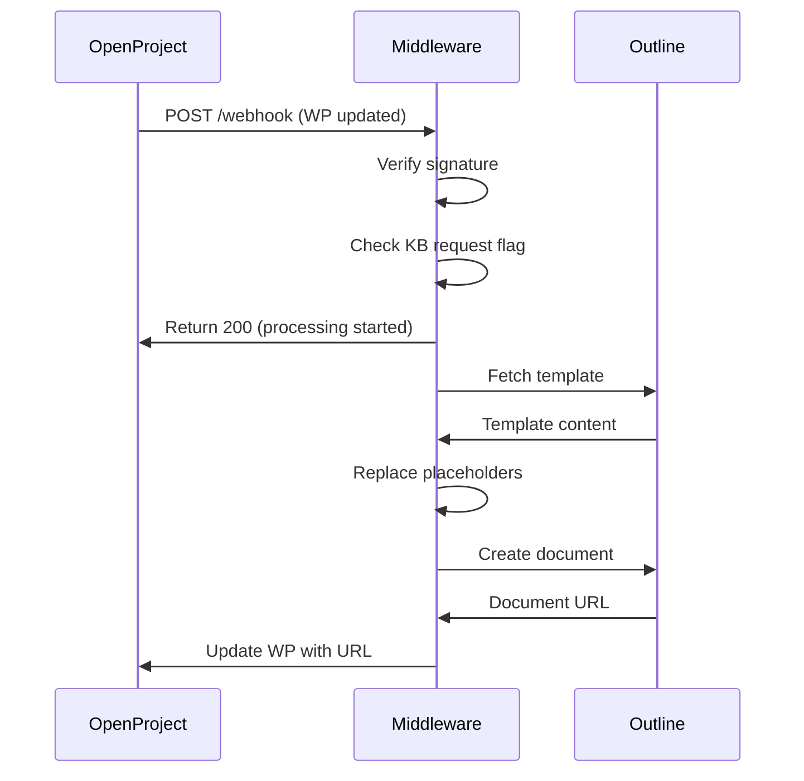

# Outline-OpenProject Middleware

A FastAPI-based middleware service that automatically creates knowledge base documents in Outline when work packages in OpenProject are flagged for KB documentation.

## Overview

This service listens for OpenProject webhooks and automatically:
1. Detects when a work package has the "KB anfordern" (KB request) flag set
2. Fetches a template document from Outline
3. Populates the template with work package details
4. Creates a new knowledge base document in Outline
5. Updates the work package with the document URL and resets the request flag

## Features

- **Webhook-based automation**: Triggered by OpenProject work package updates
- **Template system**: Uses Outline templates with placeholder substitution
- **Signature verification**: HMAC SHA256 validation of webhook requests
- **Background processing**: Non-blocking webhook handling
- **Environment validation**: Ensures all required configuration is present at startup

## Prerequisites

- Python 3.13+
- [uv](https://github.com/astral-sh/uv) package manager
- OpenProject instance with:
  - API access
  - Custom boolean field for "KB anfordern" (KB request)
  - Custom text field for "KB Link" (document URL storage)
  - Webhook capability
- Outline instance with:
  - API access
  - Collection for storing documents
  - Template document with placeholders

## Installation

### Local Development

```bash
# Clone the repository
git clone <repository-url>
cd outline-op-middleware

# Install dependencies
uv sync

# Copy environment configuration
cp .env.example .env

# Edit .env with your configuration
nano .env

# Run development server
uv run uvicorn src.outline_op_middleware.main:app --host 0.0.0.0 --port 8000 --reload
```

### Docker

```bash
# Build and run with docker-compose
docker compose up --build

# Or build and run manually
docker build -t outline-op-middleware .
docker run -p 8000:8000 --env-file .env outline-op-middleware
```

## Configuration

All configuration is done via environment variables. See `.env.example` for reference.

### OpenProject Settings

| Variable | Description | Example |
|----------|-------------|---------|
| `OP_BASE_URL` | Base URL of your OpenProject instance | `https://projekte.example.com` |
| `OP_API_KEY` | API key for authentication | Generate at: OpenProject > My Account > Access tokens |
| `OP_WEBHOOK_SECRET` | Secret for webhook signature verification | Random secure string (min 32 chars) |
| `OP_CF_KB_REQUEST` | Custom field ID for KB request flag | `8` or `customField123` |
| `OP_CF_KB_LINK` | Custom field ID for KB link storage | `7` or `customField456` |

### Outline Settings

| Variable | Description | Example |
|----------|-------------|---------|
| `OUTLINE_BASE_URL` | Base URL of your Outline instance | `https://docs.example.com` |
| `OUTLINE_API_KEY` | API token for authentication | `ol_api_xxxxxxxxxxxxx` |
| `OUTLINE_COLLECTION_ID` | Collection UUID for documents | `hyXe7XWlFn` |
| `OUTLINE_TEMPLATE_ID` | Template document UUID | `l3xEThX35t` |

## Template Placeholders

Your Outline template document can use the following placeholders:

- `{{WP_ID}}`: Work package ID number
- `{{WP_SUBJECT}}`: Work package title/subject
- `{{WP_DESCRIPTION}}`: Work package description (raw text)
- `{{WP_URL}}`: Full URL to the work package

**Example template:**
```markdown
# {{WP_SUBJECT}}

**Work Package:** [#{{WP_ID}}]({{WP_URL}})

## Description

{{WP_DESCRIPTION}}

## Resolution

_Document the resolution here..._
```

## OpenProject Webhook Setup

1. Navigate to: OpenProject > Administration > Webhooks
2. Create new webhook with:
   - **URL**: `https://your-domain.com/webhook`
   - **Events**: Check `work_package:updated`
   - **Signing secret**: Use the same value as `OP_WEBHOOK_SECRET`
3. Save the webhook

The middleware will only process requests where:
- Action is `work_package:updated`
- Custom field `OP_CF_KB_REQUEST` is `true`
- Custom field `OP_CF_KB_LINK` is empty/null

## API Endpoints

### `GET /`
Health check endpoint.

**Response:**
```json
{
  "status": "ok",
  "service": "outline-op-middleware"
}
```

### `POST /webhook`
OpenProject webhook receiver.

**Headers:**
- `X-OP-Signature`: HMAC SHA256 signature of request body
- `Content-Type`: `application/json`

**Response codes:**
- `200`: Request processed or ignored (see response body)
- `401`: Invalid signature
- `400`: Invalid JSON payload

**Response examples:**
```json
// Processing started
{
  "status": "processing_started",
  "wp_id": 12345
}

// Request ignored
{
  "status": "ignored",
  "reason": "kb_request not set"
}
```

## Development

### Running Tests

```bash
# Run webhook simulation tests
uv run python tests/test_webhook.py
```

### Linting

```bash
# Check code with ruff
uv run ruff check .

# Format code
uv run ruff format .

# Fix auto-fixable issues
uv run ruff check --fix .
```

## Workflow



## Troubleshooting

### Application won't start
- **Check environment variables**: All 9 variables must be set
- **Verify URLs**: Ensure URLs don't have trailing slashes
- **Test connectivity**: Ensure the service can reach both OpenProject and Outline

### Webhooks not processing
- **Verify signature**: Check that `OP_WEBHOOK_SECRET` matches OpenProject webhook configuration
- **Check custom field IDs**: Ensure `OP_CF_KB_REQUEST` and `OP_CF_KB_LINK` are correct
- **Review logs**: Check container/application logs for error messages

### Documents not created
- **Template ID**: Verify `OUTLINE_TEMPLATE_ID` points to a valid document
- **Collection ID**: Ensure `OUTLINE_COLLECTION_ID` exists and is accessible
- **API permissions**: Confirm the Outline API key has write permissions

## License

[Add your license here]

## Contributing

[Add contribution guidelines here]
